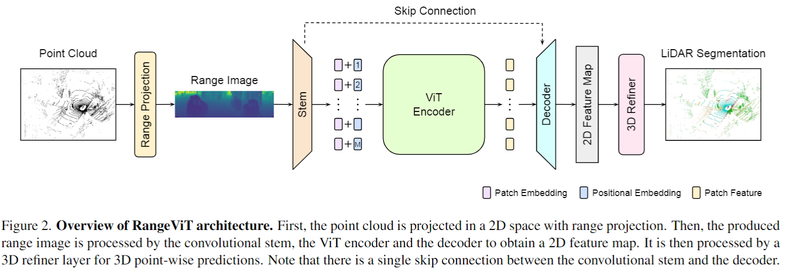

# RangeViT

<div align='center'>

**RangeViT: Towards Vision Transformers for 3D Semantic Segmentation in Autonomous Driving** [[arXiv](https://arxiv.org/abs/2301.10222)] \
*Angelika Ando, Spyros Gidaris, Andrei Bursuc, Gilles Puy, Alexandre Boulch and Renaud Marlet* \
**CVPR 2023**

<div>
  
</div>

</div>

## **Citing**

If you use our **RangeViT** code in your research, please consider citing:

```
@inproceedings{RangeViT,
  title={RangeViT: Towards Vision Transformers for 3D Semantic Segmentation in Autonomous Driving},
  author={Ando, Angelika and Gidaris, Spyros and Bursuc, Andrei and Puy, Gilles and Boulch, Alexandre and Marlet, Renaud},
  booktitle={CVPR},
  year={2023}
}
```

## **Results**

Results of RangeViT on the nuScenes validation set and on the SemanticKITTI test set with different weight initializations.

In particular, we initialize RangeViT’s backbone with ViTs pretrained (a) on supervised ImageNet21k classification and fine-tuned on supervised image segmentation on Cityscapes with [Segmenter](https://github.com/rstrudel/segmenter) (entry Cityscapes) (b) on supervised [ImageNet21k](https://github.com/huggingface/pytorch-image-models) classification (entry IN21k), (c) with the [DINO](https://github.com/facebookresearch/dino) self-supervised approach on ImageNet1k (entry DINO), and (d) trained from scratch (entry Random).

The Cityscapes pre-trained weights can be downloaded from [here](https://www.rocq.inria.fr/cluster-willow/rstrudel/segmenter/checkpoints/cityscapes/seg_small_linear/).

| Dataset                 | Pre-trained weights    | mIoU (%)    |
| ----------------------- | ---------------------- | ------------|
| nuScenes validation set | Cityscapes             | 75.2        |
| nuScenes validation set | IN21k                  | 74.8        |
| nuScenes validation set | DINO                   | 73.3        |
| nuScenes validation set | Random                 | 72.4        |
| SemanticKITTI test set  | Cityscapes             | 64.0        |

Note that the positional embeddings are initialized with the corresponding pre-trained weights or randomly when training from scratch. The convolutional stem, the decoder and the 3D refiner layer are always randomly initialized.


## **Preparation**

Please install [PyTorch](https://pytorch.org/) and then install the [nuScenes devkit](https://github.com/nutonomy/nuscenes-devkit) with

```bash
pip install nuscenes-devkit
```    

Finally, install the requirements with
```bash
pip install -r requirements.txt
```  

## **Training**

To train on nuScenes or on SemanticKITTI, use (and modify if needed) the config file `config_nusc.yaml` or `config_kitti.yaml`, respectively. For instance, to train on nuScenes, run the following command: 

```bash
python -m torch.distributed.launch --nproc_per_node=4 --master_port=63545 \
    --use_env main.py 'config_nusc.yaml' \
    --data_root '<path_to_nuscenes_dataset>' \
    --save_path '<path_to_log>' \
    --pretrained_model '<path_to_image_pretrained_model.pth>'
```

The `--pretrained_model` argument specifies the image-pretrained ViT-encoder that is used for initializing the ViT-encoder of RangeViT. For instance, to use the ImageNet21k-pretrained ViT-S encoder set ``--pretrained_model "timmImageNet21k"``. For the other initialization cases, you will need to download the pretrained weights. Read the Results section above to see where to download these pretrained weights from. Note that for all ViT-encoder initialization cases the peak learning rate of RangeViT is ``0.0008``, apart from the DINO initialization, in which case the peak learning rate is ``0.0002``.

Similarly, to train on SemanticKITTI, run the following command:
```bash
python -m torch.distributed.launch --nproc_per_node=4 --master_port=63545 \
    --use_env main.py 'config_kitti.yaml' \
    --data_root '<path_to_nuscenes_dataset>/dataset/sequences/' \
    --save_path '<path_to_log>' \
    --pretrained_model '<path_to_image_pretrained_model.pth>'
```

## **Evaluation**

The same config files can be used for evaluating the pre-trained RangeViT models. 
For instance, to evaluate on the nuScenes validation set, run the following command:

```bash
python -m torch.distributed.launch --nproc_per_node=1 --master_port=63545 \
    --use_env main.py 'config_nusc.yaml' \
    --data_root '<path_to_nuscenes_dataset>' \
    --save_path '<path_to_log>' \
    --checkpoint '<path_to_pretrained_rangevit_model.pth>' \
    --val_only
```

To evaluate on the SemanticKITTI validation set, run the following command (adding the ``--test_split`` and ``--save_eval_results`` arguements for evaluating on the test split and saving the prediction results):

```bash
python -m torch.distributed.launch --nproc_per_node=1 --master_port=63545 \
    --use_env main.py 'config_kitti.yaml' \
    --data_root '<path_to_semantic_kitti_dataset>' \
    --save_path '<path_to_log>' \
    --checkpoint '<path_to_pretrained_rangevit_model.pth>' \
    --val_only
```
